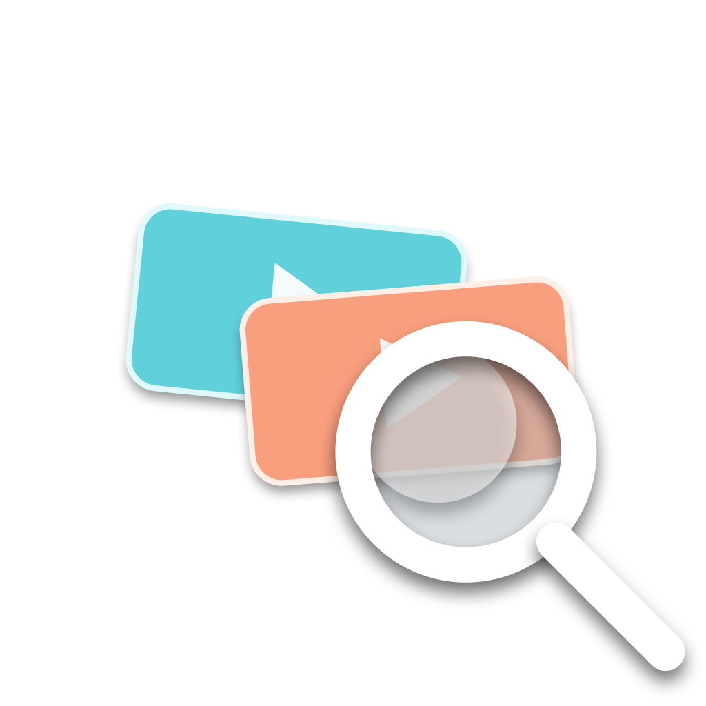
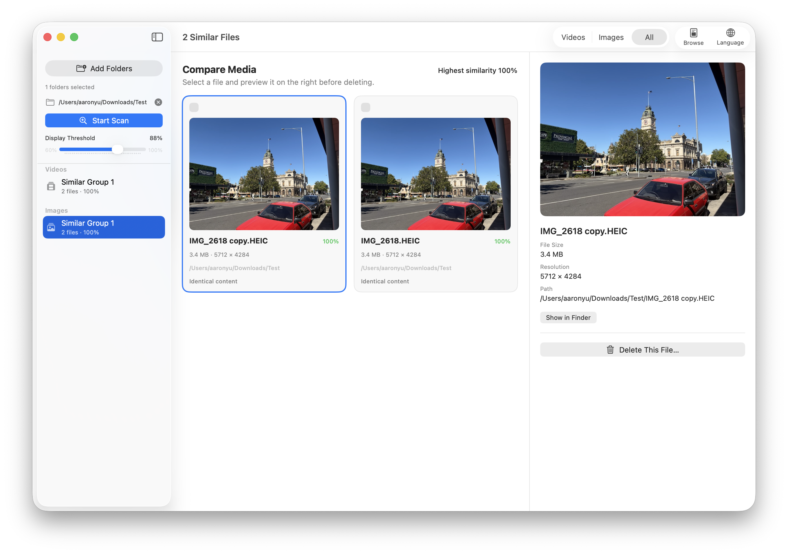
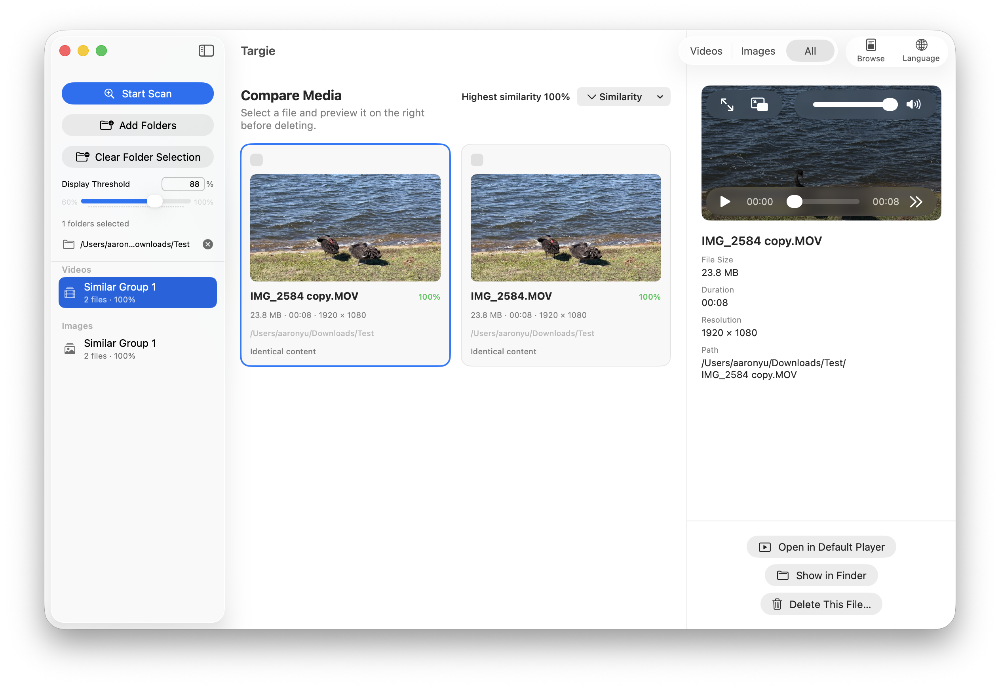
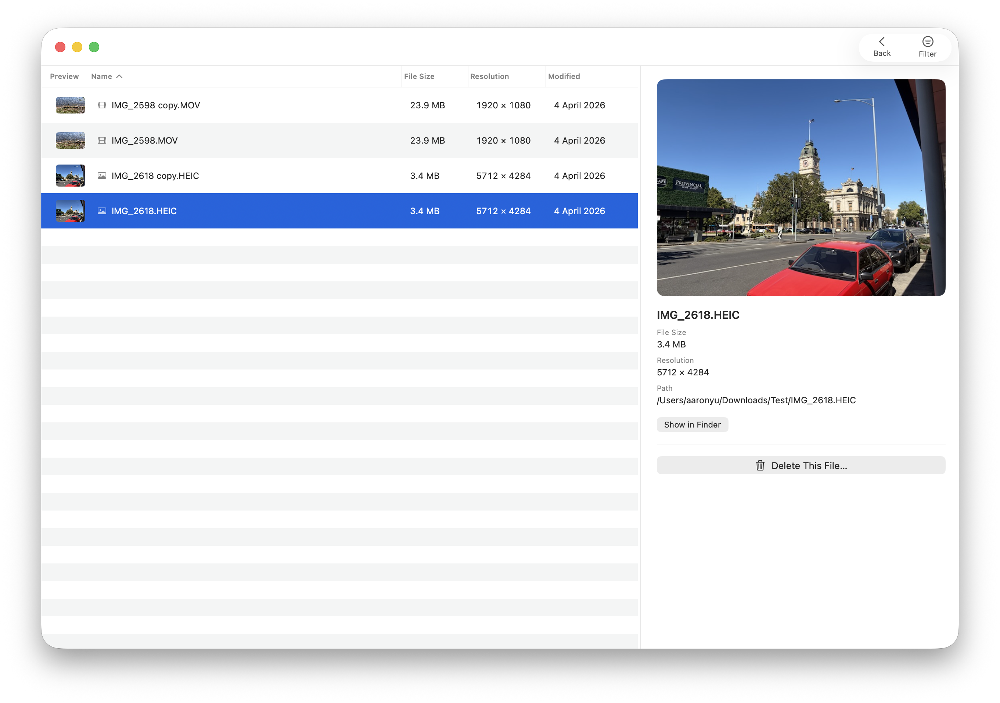

#  Targie

[English](README.md) | [简体中文](README_ZH.md) | [繁體中文](README_ZH_HANT.md) | [Español](README_ES.md) | [Français](README_FR.md) | [한국어](README_KO.md)

> **macOS 専用です。** Targie は macOS 14+ 向けのネイティブアプリです。Windows 版や Linux 版はなく、提供予定もありません。

Targie は、メタデータ、コンテンツハッシュ、知覚フィンガープリント、視覚特徴を組み合わせて、選択したフォルダ内の類似動画と画像を見つけます。

## 機能

- 動画、画像、すべてのスキャンモードを切り替えられ、選択したモードを記憶します。
- フォルダ選択画面または Finder からのドラッグ&ドロップで複数のフォルダを追加し、選択した全フォルダ間でメディアを比較します。
- 一般的な動画形式に加え、JPEG、PNG、HEIC、HEIF、WebP、TIFF、GIF、BMP 画像を再帰的にスキャンします。
- SHA-256、キャッシュ済みの知覚フィンガープリント、メタデータ、再利用可能な Vision 特徴を使い、読み取れないファイルは分離して処理します。
- 動画と画像のグループを分けて、アプリ内の静的プレビューで並べて確認できます。
- 動画を既定のプレーヤーで開き、どのメディアファイルでも Finder で表示できます。
- 明示的な複数選択と、部分成功に対応した一括削除をサポートします。
- 削除時はゴミ箱に移動するか完全に削除するかを必ず選択し、完全削除ではもう一度確認します。
- 英語、簡体字中国語、繁体字中国語、スペイン語、フランス語、日本語、韓国語を即時切り替えでき、選択した言語を記憶します。
- **閲覧モード**: 選択したフォルダ内のすべてのファイルを、並び替えとフィルタが可能な表で表示します。列幅のドラッグ調整、一括選択、フィルタ後の件数を反映するウィンドウタイトルに対応しています。







## インストール

1. [Releases](https://github.com/LiruiYu33/Targie-The-Similar-Videos-Images-Finder/releases) から最新の `Targie-v*.zip` をダウンロードします。
2. zip を展開し、**Targie.app** をアプリケーションフォルダ、または任意の場所へドラッグします。
3. このアプリは ad-hoc 署名です。初回起動時に macOS Gatekeeper がブロックします。
   - アプリを **右クリック**（または Control キーを押しながらクリック）→ **開く** → ダイアログで **開く** をクリックします。
   - または **システム設定 → プライバシーとセキュリティ** を開き、一番下までスクロールして Targie の横にある **このまま許可** をクリックしてから、通常どおりアプリを開きます。
   - この操作は一度だけ必要です。初回起動に成功すると、Gatekeeper は再度ブロックしません。

## ビルド（macOS のみ）

```bash
swift test
./script/build_app.sh
```

生成されたアプリは次の場所にあります。

```text
dist/Targie.app
```

開発時は次のコマンドでビルドして起動できます。

```bash
./script/build_and_run.sh
```

アプリはローカル利用向けに ad-hoc 署名されています。インターネット経由や App Store で配布するには、Developer ID、公証、適切なパッケージング手順が必要です。

## ライセンス

Targie は **[GNU General Public License v3.0](LICENSE)** の下でライセンスされています。

Copyright (C) 2026 Lirui Yu.

このコードを再利用する場合（変更の有無を問わず）:

- 著作権表示を保持し、原作者（Lirui Yu）を明記する**必要があります**。
- 配布する派生作品は、GPL-3.0（またはそれ以降の GPL バージョン）の下で同様に公開し、利用者が完全なソースコードを入手できるようにする**必要があります**。
- クローズドソースまたはプロプライエタリな再配布は**許可されません**。

法的な全文は [LICENSE](LICENSE) ファイルを参照してください。

## コントリビューション

Pull Request を歓迎します。すべての commit は [Developer Certificate of Origin (DCO)](DCO) に基づいて sign-off する必要があります。`git commit` に `-s` を付けてください。詳細は [CONTRIBUTING.md](CONTRIBUTING.md) を参照してください。
